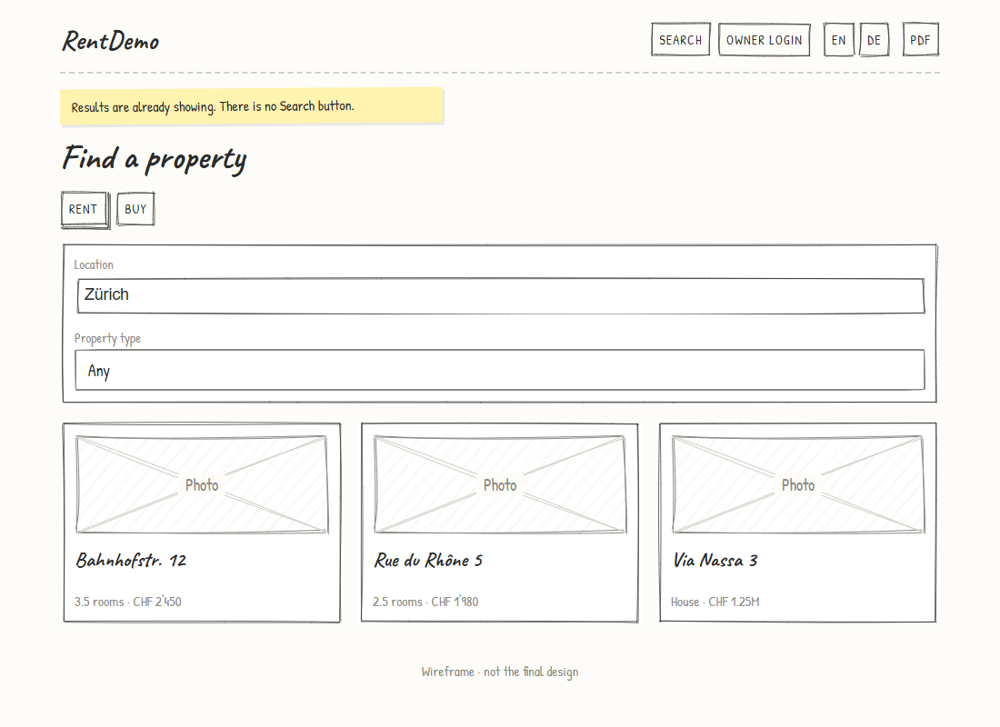
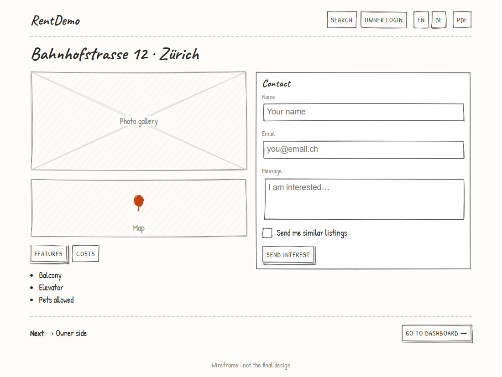
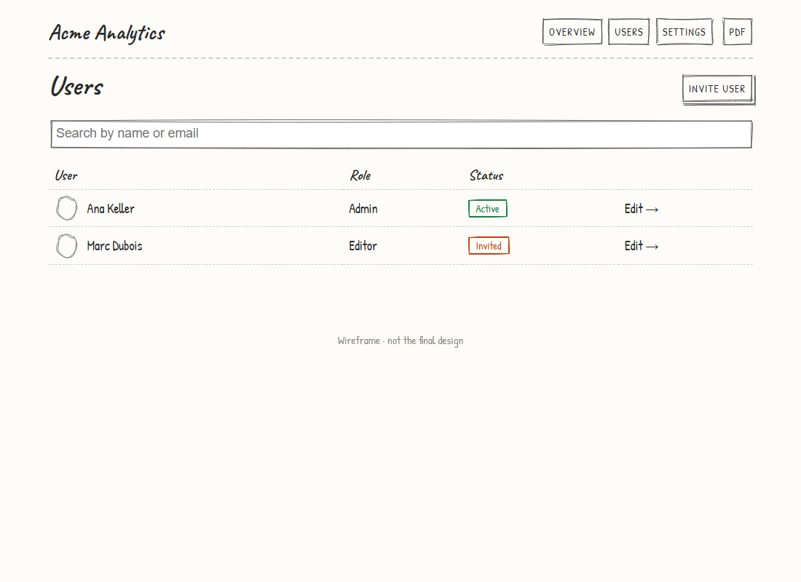

# sketchframe

**Describe screens in YAML. Get a clickable, hand-drawn wireframe prototype.**

Static HTML you can host or open from disk, plus PDF and PNG export. Built on [wired-elements](https://github.com/rough-stuff/wired-elements) and [RoughJS](https://github.com/rough-stuff/rough), so it looks like a sketch and nobody mistakes it for the final design.

<p>
  
  
</p>

```yaml
name: Shop
nav:
  - { label: Home, go: home }
screens:
  - id: home
    title: Home
    blocks:
      - { type: h1, text: Welcome }
      - type: card
        go: product                         # click → opens the product screen
        children:
          - { type: image, h: 120, label: Photo }
          - { type: h3, text: Blue shirt }
  - id: product
    title: Product
    blocks:
      - { type: button, label: Add to cart, primary: true, toast: Added }
```

## Why

- **Fast to write and change.** A screen is a dozen lines of YAML, not a page of HTML or an hour in a design tool.
- **Clickable.** Buttons, cards, table rows and nav items link between screens; forms, tabs, chips and toggles respond, so stakeholders can walk through a flow.
- **Looks like a sketch on purpose.** Feedback goes to structure and flow, not colours and fonts.
- **Safe for AI to write.** Generate a spec with an assistant; `validate` catches typos and dead links with exact locations. See [docs/ai-assistants.md](docs/ai-assistants.md).
- **Easy to share.** One static folder, one PDF, or one PNG per screen. Multi-language prototypes are built in.

## Quick start

```bash
npx sketchframe init my-wireframes
cd my-wireframes
npx sketchframe dev            # live preview at http://localhost:3000
```

```bash
npx sketchframe validate       # check the spec
npx sketchframe build          # static site → dist/
npx sketchframe pdf            # dist/<name>.pdf, one screen per page
npx sketchframe png            # dist/png/<screen>.png
npx sketchframe blocks         # list every block and its props
```

Requires Node 20+. PDF and PNG export need Chrome, Chromium or Edge installed (set `CHROME_PATH` if it isn't found).

## What you can draw

28 blocks across layout (`stack` `row` `grid` `card` `divider` `spacer`), text (`h1`–`h3` `text` `list` `note` `badge`), media (`image` `map` `box`), forms (`input` `textarea` `select` `checkbox` `toggle` `radio` `slider`), actions (`button` `chips` `tabs` `nextbar`) and data (`table`). See the [block reference](docs/blocks.md).

<p>
  
  
</p>

Also: named header navigation per screen (public vs admin), yellow sticky-note annotations, CSS-variable theming, an assets folder, and a JSON Schema for editor autocomplete.

## Documentation

- [Getting started](docs/getting-started.md)
- [Spec reference](docs/spec.md): navigation, languages, theming, assets
- [Block reference](docs/blocks.md)
- [Working with AI assistants](docs/ai-assistants.md)
- [Extending](docs/extending.md): add a block, change the look, use the API
- [Architecture](docs/architecture.md)
- [Examples](examples): a rental portal (multi-language, two nav sets) and a SaaS admin

## Use it from code

```js
import { build, validate, exportFiles } from "sketchframe";

await build({ dir: "./my-project", out: "dist" });
await exportFiles({ dir: "./my-project", png: true });
```

## Contributing

Issues and pull requests are welcome; see [CONTRIBUTING.md](CONTRIBUTING.md). Adding a block is one object in `src/render/blocks/`.

## License

[MIT](LICENSE)
