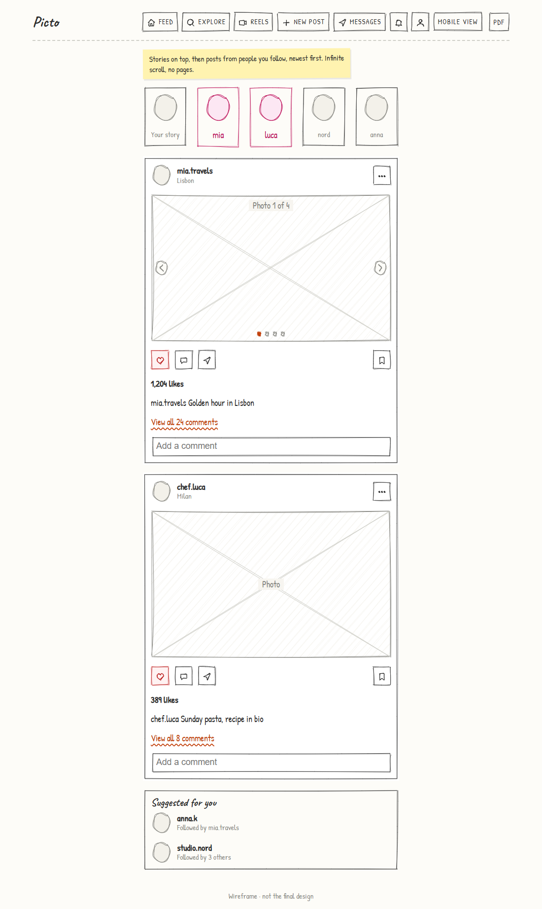
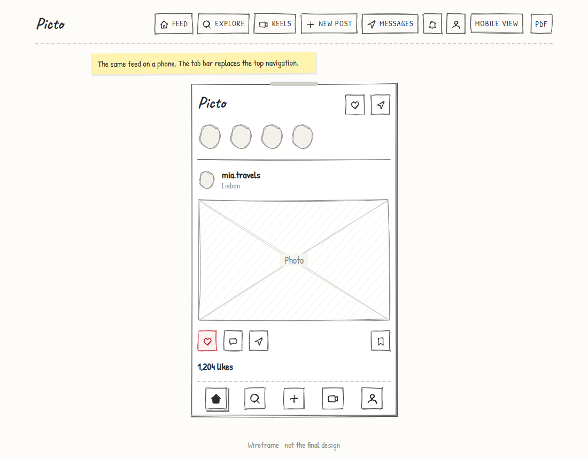
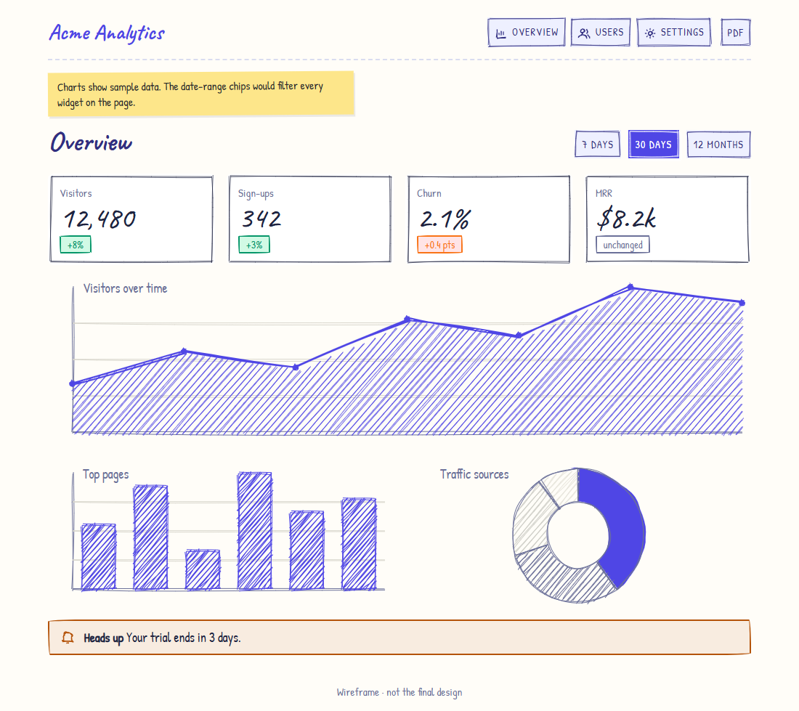
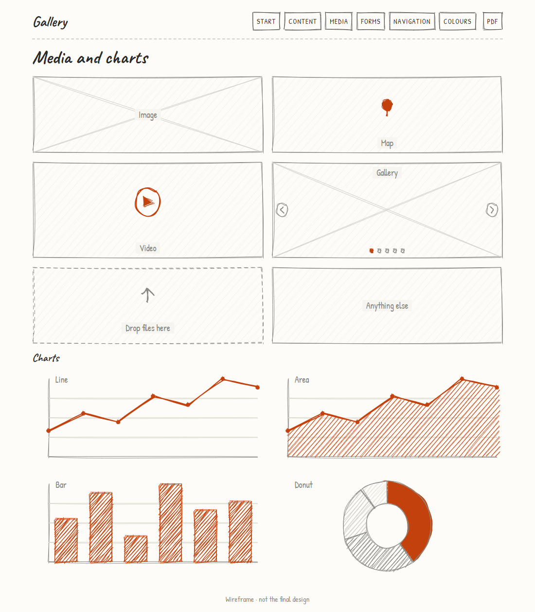
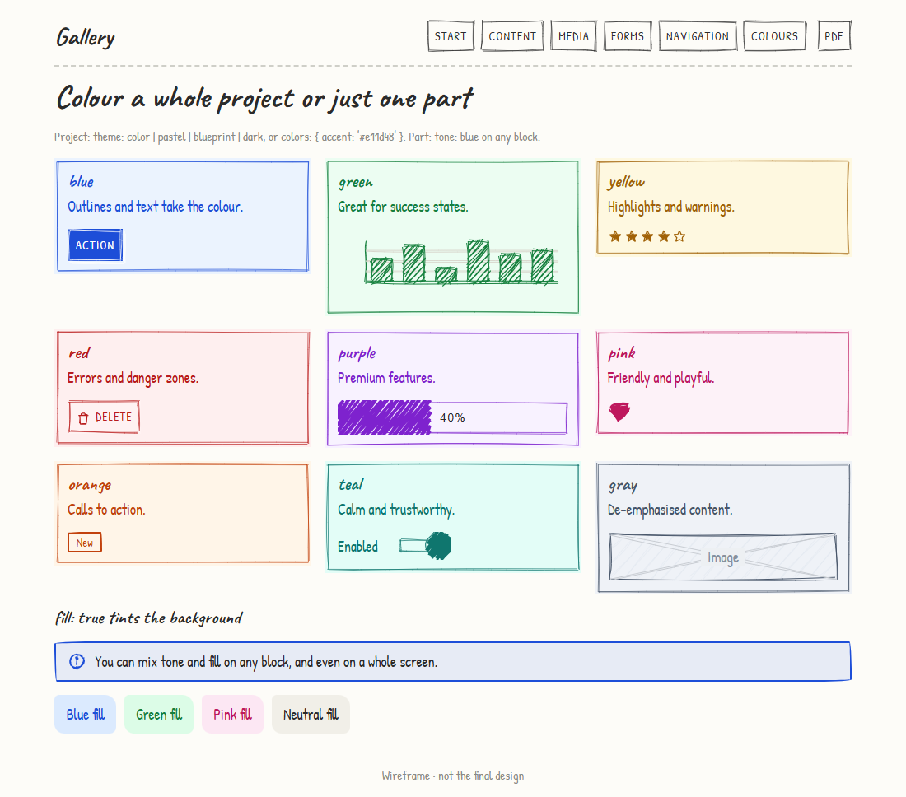
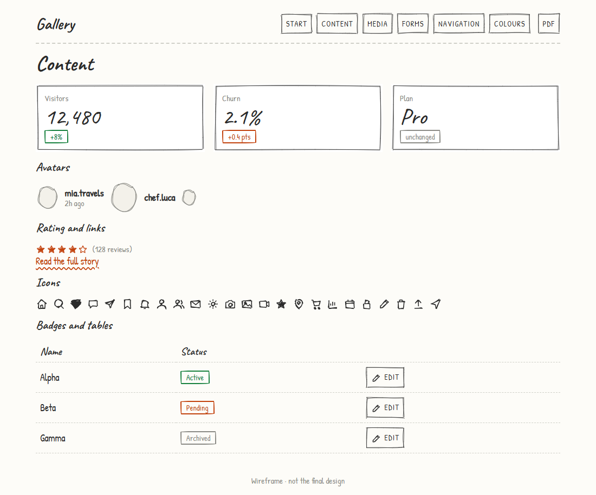
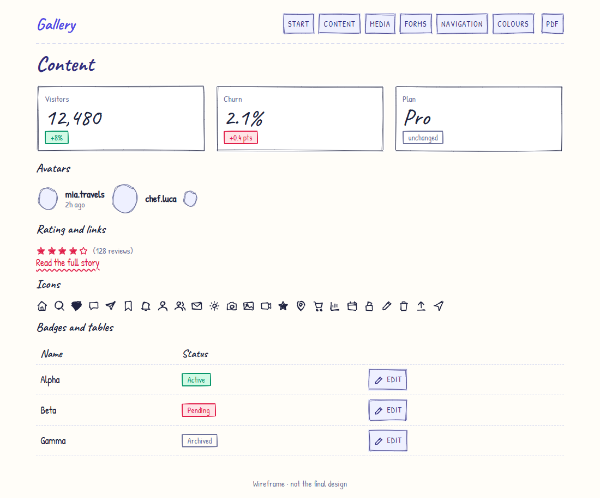
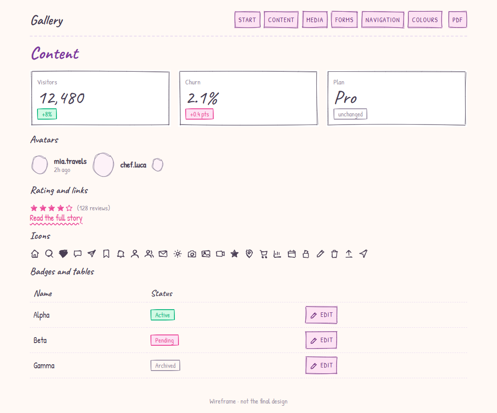
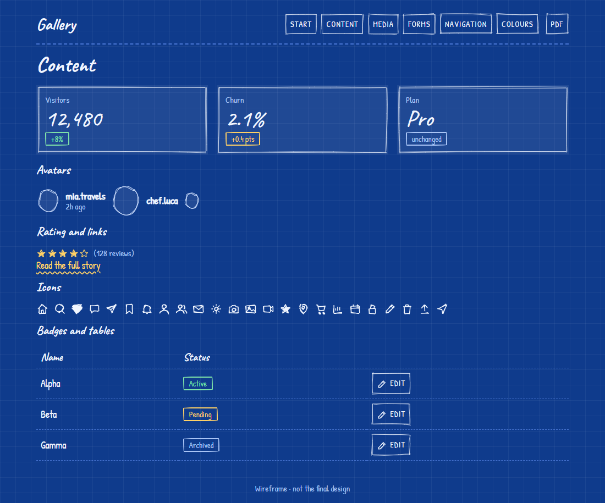
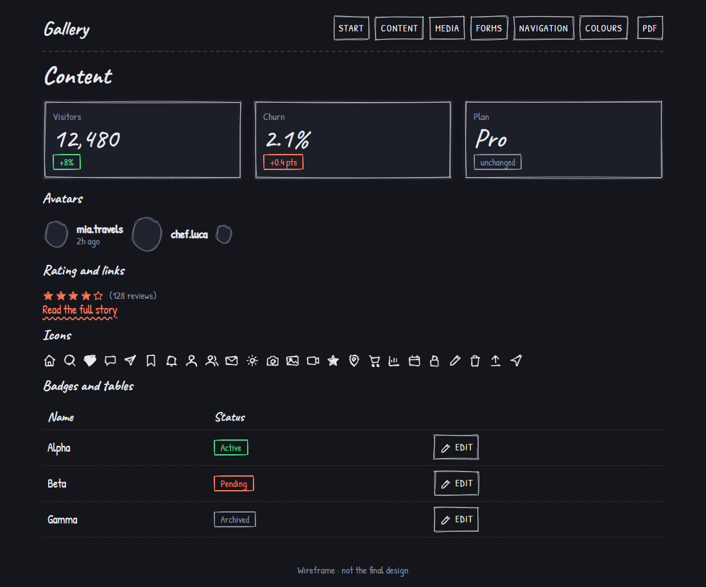

# Open Ink

**Describe screens in YAML. Get a clickable, hand-drawn wireframe prototype.**

Static HTML you can host or open from disk, plus PDF and PNG export. Built on [wired-elements](https://github.com/rough-stuff/wired-elements) and [RoughJS](https://github.com/rough-stuff/rough), so it looks like a sketch and nobody mistakes it for the final design. Keep it plain pencil, or turn on colour for a whole project or just one part.

<p>
  
  
  
</p>

```yaml
name: Shop
theme: color                                   # optional: sketch (default) | color | pastel | blueprint | dark
nav:
  - { icon: home, label: Home, go: home }
screens:
  - id: home
    title: Home
    blocks:
      - { type: h1, text: Welcome }
      - type: card
        go: product                            # click → opens the product screen
        children:
          - { type: image, h: 120, label: Photo }
          - { type: h3, text: Blue shirt }
          - { type: rating, value: 4, text: (128 reviews) }
  - id: product
    title: Product
    blocks:
      - { type: button, label: Add to cart, icon: cart, primary: true, open: added }
modals:
  - id: added
    title: Added to cart
    children:
      - { type: button, label: Keep shopping, close: true, go: home }
```

## Why

- **Fast to write and change.** A screen is a dozen lines of YAML, not a page of HTML or an hour in a design tool.
- **Clickable.** Buttons, cards, table rows, tab bars and nav items link between screens; forms, tabs, accordions, modals, chips and toggles respond, so stakeholders can walk through a flow.
- **Looks like a sketch on purpose.** Feedback goes to structure and flow, not fonts and pixels.
- **Colour when you want it.** Themes for a whole project, `tone: pink` for one card, `fill: true` for a tinted panel.
- **Safe for AI to write.** Generate a spec with an assistant; `validate` catches typos, dead links and bad icon names with exact locations. See [docs/ai-assistants.md](docs/ai-assistants.md).
- **Easy to share.** One static folder, one PDF, or one PNG per screen. Multi-language prototypes are built in.

## Quick start

```bash
npx openink init my-wireframes
cd my-wireframes
npx openink dev                 # live preview at http://localhost:3000
```

```bash
npx openink validate            # check the spec
npx openink build               # static site → dist/
npx openink pdf                 # dist/<name>.pdf, one screen per page
npx openink png                 # dist/png/<screen>.png
npx openink blocks              # list every block and its props
npx openink dev --theme dark    # try a colour theme without editing the spec
```

Or install it once and drop the `npx`:

```bash
npm install -g openink
openink dev
```

Requires Node 20+. PDF and PNG export need Chrome, Chromium or Edge installed (set `CHROME_PATH` if it isn't found).

## What you can draw

48 blocks in 10 groups; see the [block reference](docs/blocks.md) and the [gallery example](examples/gallery), which shows every one.

| | |
|---|---|
| **Layout** | `stack` `row` `grid` `card` `accordion` `device` (phone / tablet / browser frame) `divider` `spacer` |
| **Text** | `h1` `h2` `h3` `text` `list` `note` `badge` |
| **Content** | `icon` (37 hand-drawn icons) `avatar` `hero` `stat` `rating` `link` |
| **Media** | `image` `map` `video` `carousel` `dropzone` `box` `chart` (line, area, bar, pie, donut) |
| **Forms** | `input` `search` `textarea` `select` `checkbox` `toggle` `radio` `slider` |
| **Actions** | `button` (with icon) `chips` `tabs` `nextbar` |
| **Navigation** | `breadcrumb` `pagination` `steps` `tabbar` |
| **Feedback** | `alert` `progress` |
| **Overlays** | `modal` (global, opened from any screen) |
| **Data** | `table` |

<p>
  
  
</p>

## Colour

Plain pencil is the default. Colour is opt-in, at three levels:

| Level | How |
|---|---|
| Whole project | `theme: color \| pastel \| blueprint \| dark` and `colors: { accent: "#f97316" }` |
| One screen | `tone: blue` on the screen |
| One part | `tone: red` and `fill: true` on any block, e.g. only the "Delete" button, or a highlighted card |

<table>
  <tr>
    <td><br /><sub><code>sketch</code> (default)</sub></td>
    <td><br /><sub><code>color</code></sub></td>
    <td><br /><sub><code>pastel</code></sub></td>
  </tr>
  <tr>
    <td><br /><sub><code>blueprint</code></sub></td>
    <td><br /><sub><code>dark</code></sub></td>
    <td></td>
  </tr>
</table>

Details: [docs/spec.md#colour](docs/spec.md#colour).

## Examples

| Example | Shows |
|---|---|
| [`photo-sharing`](examples/photo-sharing) | 17 screens: feed, stories, reels, explore, messages, profile, a phone-frame mobile view, global modals, and colour on only a few parts |
| [`saas-admin`](examples/saas-admin) | The `color` theme: stat cards, area/bar/donut charts, tables, an invite modal |
| [`rental-portal`](examples/rental-portal) | Two languages and two header nav sets (public vs owner) |
| [`gallery`](examples/gallery) | Every block on one screen per family; try it with `--theme dark` |

```bash
npx openink dev examples/photo-sharing
```

## Documentation

- [Getting started](docs/getting-started.md)
- [Spec reference](docs/spec.md): screens, colour, modals, navigation, languages, icons
- [Block reference](docs/blocks.md)
- [Working with AI assistants](docs/ai-assistants.md)
- [Extending](docs/extending.md): add a block, change the look, use the API
- [Architecture](docs/architecture.md)

## Use it from code

```js
import { build, validate, exportFiles } from "openink";

await build({ dir: "./my-project", out: "dist", theme: "dark" });
await exportFiles({ dir: "./my-project", png: true });
```

## Contributing

Issues and pull requests are welcome; see [CONTRIBUTING.md](CONTRIBUTING.md). Adding a block is one object in `src/render/blocks/`.

## License

[MIT](LICENSE)
